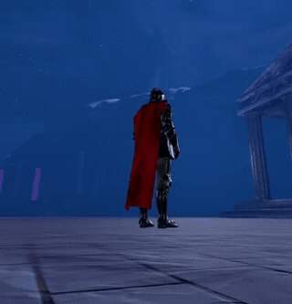

# GPU Cloth Sim

GPU-accelerated cloth simulation for Godot 4.5+ using Position-Based Dynamics on compute shaders.

## Demo



## Video Tutorial


[](https://youtu.be/Ta_X90fqqZ4)
^^ click me

## Support
Join the discord for support :) -- https://discord.gg/maFsFAfqnY

## What's New in 3.0.0

Substrate rewrite plus a full body-and-cloth collision stack. The solver now simulates on *welded particles* with GPU-side normal computation and storage-texture mesh writeback (no more per-frame CPU mesh readback), and it can stack multiple cloth solvers that collide against each other AND against a character's animated body — silhouette-accurate. The fold-through artifacts that used to break flag normals are gone, the per-frame CPU stall is gone, and animated characters with shirts AND pants on the same skeleton just work. Six pieces compose:

- **GPU substrate** — particle positions, predicted positions, velocities, and normals all live in storage buffers; render meshes read positions + normals from storage textures bound to the vertex shader (`positions_tex` / `normals_tex` sampled via a `VERTEX_ID → welded_idx` lookup texture). No per-frame `ArrayMesh` writeback, no `_rd.sync()` stall — the GPU pipeline runs end-to-end, and the rendered mesh just samples the simulation's textures in the vertex stage. Compute passes compose freely without forcing readbacks: predict → constraints → collisions → update → normals → output, all in one command list.
- **Body-derived colliders, one mesh source.** A single `body_mesh` export feeds three independent collider techniques that each opt in via their own LOD knob: **auto-fitted bone capsules** (`auto_collider_lod`, fits one capsule per qualifying bone using bone-weighted vert distributions with percentile-trimmed radii), **sphere cloud** (`body_sphere_lod`, dense per-vert sphere coverage for irregular regions where capsules can't fit), and a **decimated skinned triangle mesh collider** (`body_collider_voxel_resolution`, voxel-clusters body verts to a low-poly proxy and skins each tri's verts via single-bone dominant weight per frame). Pick one for cheap bulk coverage, or stack them — the triangle mesh is silhouette-accurate where capsules approximate. Drives `cloth_skin_offset` so cloth particles physically sit off the body, plus a `body_collider_thickness` "padding" knob that controls the contact gap and `collider_friction` for Bridson Coulomb damping at every contact (kills the velocity injection that propagates as jitter through structural constraints).
- **Multi-cloth: peer cloth-cloth collision** — list other solvers in the `peer_cloth_solvers` array and each peer's *current* animated geometry becomes a triangle SDF collider for this solver. Peers share buffers via the main `RenderingDevice` (no copy, no per-frame readback), so a shirt-on-pants setup is just two solvers naming each other as peers. Each solver pre-builds a **decimated peer-collision proxy** (voxel-clustered welded particles, `peer_collider_voxel_resolution`) — peers bind the small proxy index buffer (typically 200-500 tris from a 6000-tri cloth) plus our full positions buffer, dropping per-frame cost by ~20× vs colliding against the full mesh. Per-frame cost = `peer_proxy_tri_count × our_particle_count`, dispatched once per substep.
- **Self-collision** — the same peer-proxy infrastructure pointed at self. Enable `self_collide` and each particle SDF-pushes out of its own decimated proxy mesh every substep, with the shader skipping triangles where the testing particle is a vertex (else infinite-direction push). Fold-through that used to break flag normals (overlapping faces averaged to zero in the normal accumulator, producing black holes) goes away because layers physically separate by `self_collide_thickness` (default 5 mm) instead of overlapping. Lets you crank `max_travel_distance` without tunneling artifacts.
- **Skinned-target sanitization** — once per frame, BEFORE the substep loop, a sanitizer pass pushes every particle's *skinned target* (the bone-driven position cloth attaches to) out of every active collider — body capsules, body triangle mesh, AND every peer cloth's current geometry. Kills the rest-jitter / rest-clipping cycle: without it, anchor positions sit inside the body or inside a peer cloth, every substep snaps pinned particles back into that volume, collide pushes them out, and the cycle propagates structurally as visible jitter. With it, anchor positions are always reachable from outside collider volumes; rest is genuinely at rest.
- **Per-particle thickness** — both peer and body collide passes multiply the base thickness by per-particle `cloth_weight` (the same vertex-color value that drives attachment stiffness). Pinned particles (weight 0) contribute zero thickness so they don't fight their snapped anchor; blend-zone particles (weight 0.3-0.7) get proportionally less push; fully-free particles (weight 1) get the full base thickness. Without this, the attachment-region "tight chest" verts kept pushing themselves out of the body and away from their pin targets — the same blend channel now correctly suppresses self-push where the cloth is meant to be attached.

> **Authoring model in v3.0:** vertex-color channel R = **cloth weight** (0 = anchored to skinned target, 1 = free PBD); `Marker3D` pins are **orthogonal** to weights (a particle can be pinned to a marker AND have a free cloth weight, in which case the marker overrides the skinned target). Pick a channel via `cloth_weight_channel`. Anchored verts (weight near 0) are inverse-mass 0 in the solver.

> **Debug:** `debug_show_particles` (colored crosses + velocity vectors), `debug_show_colliders` (cyan capsules, yellow sphere cloud, green body triangle mesh, magenta manual colliders, all in their current animated pose), and `debug_show_peer_proxy` (orange wireframe of the cloth-cloth proxy mesh deforming with the simulation in real time) — leave the collider overlay on while tuning.

> **Migration:** `flip_normals` default is now `true` — Blender/glTF round-trips overwhelmingly land here producing inward right-hand-rule normals, and four out of five existing scenes already set it true. A single existing scene that relied on `false` (`Demo/Assets/LowPolyDude/low_poly_dude.tscn`) now sets it explicitly. The old separate `body_collider_mesh` export was collapsed into `body_mesh` — set `body_collider_voxel_resolution > 0` to opt into the triangle mesh collider.

## What's New in 2.1.0

Bone-driven attachment + per-vertex sim mask. Drop a skinned cape into the solver, paint a mask layer in Blender saying "rigid here, free here," and the solver does the right thing on the same mesh — collar tracks the spine bone every frame, hem swings under gravity, smooth blending in between. The standard production-cloth pipeline, with no in-engine UI required. Three pieces compose:

- **Bone bindings from imported mesh.** New `skeleton: NodePath` export. The solver reads `ARRAY_BONES`/`ARRAY_WEIGHTS` from the source mesh, captures each bone's init pose in solver-local space, and per frame uploads `Skeleton3D.get_bone_global_pose(b)` to a small mat4 buffer. A new compute pass (`cloth_skinning.glsl`) skins each particle's *attachment target* per substep — same compute primitive as the v1.4 fishing-line pass, just with bone matrices replacing pin positions.
- **Continuous sim mask** painted as a vertex color attribute. New `sim_mask_from_vertex_color` + `sim_mask_channel` exports. `mask = 0` (paint black) → particle rigidly follows its skinned target every frame. `mask = 1` (paint white) → free PBD simulation, bounded by `skin_attach_radius`. Smooth values lerp the attachment stiffness — this is the keystone for "tight chest, loose hem on the same garment." The continuous mask subsumes v2.0's binary `pin_from_vertex_color`, which is now deprecated and forwards to the new path with threshold-0.5 binarization.
- **Same mask, three target sources.** When `skeleton` is wired, the target is bone-driven. When `pin_targets` (`Marker3D`s) are set instead, the target is the K-nearest pin blend. When neither is wired, the target is the particle's init local position. The mask interpretation is identical across all three regimes — lets you drop a painted cape in the solver and see the mask working before you wire up a skeleton, then add the skeleton incrementally.

> **Migration:** `pin_from_vertex_color` keeps working with a deprecation warning. Note the semantic flip when migrating: the old "high channel value = pinned" became "low channel value = rigid" in the continuous mask. If you painted *white-where-pinned* in Blender for v2.0, you'll want to invert that channel for the new continuous mask (or just keep using the deprecated path until you re-paint).

## Blender Authoring Pipeline

The end-to-end workflow for a skinned cape (or any garment):

1. **Model the garment** in Blender. Standard modelling — keep topology cloth-friendly (avoid degenerate triangles), UV unwrap normally.
2. **Rig.** Parent the garment to your character's existing armature (`Object → Parent → With Empty Groups` if you'll paint weights manually). For a cape you typically need 1-3 bones (spine top, neck, optionally a controller for the cape itself).
3. **Weight paint bones.** Standard Blender Weight Paint mode. Paint full weight to the parent bone(s) on the **collar / attachment region**. Leave the **simulation region** unweighted — those particles aren't bone-driven, they'll be pure simulation.
4. **Add the `sim_mask` vertex color layer.**
   - In `Object Data Properties → Color Attributes`, add a new `Face Corner ▸ Byte Color` attribute named `sim_mask`. (Float Color works too; both export to `.glb` as vertex color.)
   - Switch to Vertex Paint mode, select the new attribute as the active one.
   - **Paint black** where the cloth should rigidly follow bones (collar, chest panel — the bone-weighted region from step 3).
   - **Paint white** where the cloth should freely simulate (hem, sleeves — the unweighted region).
   - **Paint grey** for soft attachment falloff (the transition strip between rigid and free, typically 1-3 cm wide).
   - The mask uses the **alpha channel** by default (matches industry convention). Switch to alpha-only painting in Vertex Paint, or paint into RGBA and set `sim_mask_channel` to whichever channel you used.
5. **Export `.glb`** with Mesh + Armature. Tick "Vertex Colors" and "Skinning" in the export panel.
6. **In Godot:** add a `GPUClothSolver` node. Set `source_mesh` to the imported mesh. Set `skeleton` to the imported armature's `Skeleton3D` node. Toggle `sim_mask_from_vertex_color = true`. Run.

Mental model: **bone weights say *where* the cloth attaches; the sim_mask says *how rigidly*.** They're orthogonal channels of authoring intent. The mask works without a skeleton too — useful for debugging the painting before wiring up rigging — in which case `mask = 0` particles freeze at their init local position and `mask = 1` particles soft-attach to init within `skin_attach_radius`.

## What's New in 2.0.0

Custom-mesh source. The solver no longer hardcodes a planar grid — assign any `Mesh` resource (imported `.gltf`/`.fbx`/`.obj` or a programmatic `ArrayMesh`) to the new `source_mesh` export and the cloth simulates on that mesh's actual topology. UV seams persist; pins can be painted in Blender via vertex color; bending behaviour is derived from edge-shared triangle pairs. Five things compose to make this work:

- **Vertex welding** — imported meshes duplicate vertices at UV seams and hard-normal edges (same world position appears 2-6 times). Without welding the simulation tears apart at every seam. The solver spatial-hashes positions, checks neighboring cells by true distance against `weld_epsilon`, and collapses coincident verts into a unique particle set while keeping a remap from original render slots to welded particles.
- **Topology-driven constraints** — structural constraints are emitted from each unique edge in the welded mesh, with rest distance set from the initial Euclidean separation. Bending constraints come from edge-shared triangle pairs (the two non-shared vertices) instead of the v1.x grid-specific "skip-one" pattern. Toggle via `bending_from_topology`.
- **Runtime graph coloring** — source-mesh constraints are colored at init. A greedy coloring pass walks the constraint list and places each constraint into the first group whose vertex set doesn't already contain either endpoint. The solver dispatch loop iterates `_constraint_groups` so arbitrary topology produces correct race-free dispatches.
- **Render-vertex preservation** — the simulation runs on welded particles but rendering uses the input mesh's original vertex slots, indices, and UVs. Two slots on either side of a UV seam map to the same particle (so they get the same world position) but keep their distinct UVs and per-face normals. Tangents are recomputed per-frame from UV gradients.
- **Vertex-color pin authoring** — flip `pin_from_vertex_color`, set a channel + threshold, and weight-paint a pin mask in Blender. Welded particles whose source vertices exceed the threshold are marked `inverse_mass = 0`. `pin_targets` (`Marker3D` based) still works for dynamic anchors.

> **Compatibility:** existing scenes with no `source_mesh` assigned keep the original `cloth_width × cloth_height` grid path unchanged. `pin_top_row` is honoured only on the grid path; with a `source_mesh` it's ignored (with a warning).

## What's New in 1.4.0

The fishing-line constraint matures from "single nearest pin" into a properly generalized binding system. Three changes that compose:

- **Velocity-aware projection** — when the fishing-line constraint clamps a particle to its boundary sphere, the outward radial component of velocity is now zeroed. Pure tangential motion is preserved. Previously the particle would buzz against the boundary every frame because its outward velocity kept pushing it back outside; now it slides along the boundary like a real piece of fabric reaching the end of its tether. Subtle visually but kills a real source of high-frequency jitter.
- **Per-particle stretch via `stretch_curve`** — a new optional `Curve` resource lets you author "stiff at the pin row, looser at the hem" with one curve. Sampled by `row_index / (cloth_height - 1)`, so curve `t = 0` is the top row and `t = 1` is the bottom. When unassigned (or the curve has no points), falls back to the scalar `fishing_stretch`. Stretch is baked into the bindings buffer at init, so per-particle authoring costs zero runtime.
- **K-nearest binding** — each free particle is now bound to its `K` nearest pins (default `K = 4`) with weights inversely proportional to rest distance. The constraint clamps to the *weighted blend* of pin positions, with a *weighted blend* of per-binding max distances. Eliminates the "Voronoi seam" artifact you'd see between regions assigned to different pins on a cloth with multiple pins. `K = 1` reproduces v1.3 behaviour. Each step of `K` adds 16 bytes per particle to the binding buffer; cost is dominated by the cloth size, not `K`.

> **API note:** the old `fishing_stretch` scalar still works as the default. `stretch_curve` is opt-in. `bindings_per_particle` defaults to 4 — if you want the v1.3 single-anchor behaviour exactly, set it to 1.

## What's New in 1.3.1

- **World-down gravity fix** — gravity used to be applied in solver-local space, so rotating the `GPUClothSolver` node in the world tilted "down" with it (a 90° roll made cloth fall sideways). The CPU now transforms world-space gravity into solver-local each frame before pushing it to the predict shader, the same way wind has always worked. Push constant grew from 64 to 80 bytes; all four core compute shaders updated to match.
- **Surface shader documentation** — the procedural fabric shader (silk / linen / lava, borders, emblems, grunge, wear, shape mask, voxel-AO consumer) is no longer a one-line bullet in the README. Full uniform reference now lives in the [Cloth Surface Shader](#cloth-surface-shader) section.

## What's New in 1.3.0

- **Fishing-line anchor constraint** — borrowed from the Ghost of Tsushima cloth pipeline. PBD's spring network propagates tension one link per iteration, so a tall cape's bottom row keeps drooping for several frames before the top pin "tells" it to stop. The fishing line precomputes each particle's nearest pin and rest distance, then hard-clamps every free particle to within `fishing_stretch × rest_distance` of that pin's *current* position each substep — propagating tension in O(1) instead of O(grid). Lets stiff cloth actually feel stiff at low iteration counts. One extra compute pass, ~particle_count threads, no graph-coloring needed (each thread reads only its own anchor's position). Disable via `enable_fishing_line` if you want pure PBD behaviour.

## What's New in 1.2.0

- **Per-particle voxel ambient occlusion** — a 5th compute pass voxelizes the cloth's particles into a small bit-packed grid (default 32×32×16) each frame, then samples a neighborhood per particle to compute occlusion. The result is read back alongside positions, written to vertex `COLOR.r` (visibility), and consumed by the surface shader as Godot's `AO` builtin output. Folds darken naturally with no screen-space noise, view-independent, ~0.2 ms on a mid-range GPU.
- **Double-sided lighting fix** — back-face normal-map handling now flips the tangent-space z component so cloth back faces light correctly. Previously the procedural fabric normal pointed the wrong way on the side facing away from the camera/light, producing flat or wrong shading.

## What's New in 1.1.0

- **Procedural fabric surface shader** — silk, linen, and animated lava fabric types with primary/secondary tint, border trim (per-edge bitmask), emblem layer, dirt, and edge wear. Replaces the previous minimal default shader.
- **Shape-mask UV cutout** — bind a `sampler2D` to `shape_mask` and the fragment shader `discard`s where the red channel falls below `shape_mask_threshold`. Lets you cut non-rectangular cloth shapes (banners, ragged hems, perforations) without changing the simulation grid.
- **Async GPU readback** — the solver now submits compute work and defers the `_rd.sync()` to the next physics frame, so the GPU pipelines simulation against the next frame's CPU work instead of stalling.
- **Smoothed pin tracking** — pins lerp toward their marker target each frame instead of teleporting, eliminating cloth snap when markers move quickly. Tunable via `pin_smooth_speed`.
- **Explicit collider list** — new `collider_targets: Array[NodePath]` lets the solver track colliders that aren't direct children (e.g. bones in a skeleton). Falls back to child auto-discovery when empty.
- **Numerical stability fixes** — inertia magnitude clamped per substep to prevent cloth collapse on fast parent motion; constraint solver falls back to a gravity-axis correction direction when particles fully collapse instead of producing NaNs.

> **Migration note:** the new default shader uses different uniform names (`fabric_type`, `primary_color`, `secondary_color`, etc.). The old `albedo_texture` / `color_tint` uniforms no longer exist. Existing scenes that wired those will need their `shader_parameter/*` fields updated.

## Features

- **Full GPU pipeline** — predict, constraint solve, collision, normal computation, and mesh output all run as compute shaders; no per-frame CPU mesh readback (render meshes sample positions/normals from storage textures bound to the vertex shader)
- **Position-Based Dynamics** with graph-colored constraint solving — no race conditions, no atomics, fully parallel per constraint group
- **Multi-cloth interaction** — list other solvers in `peer_cloth_solvers` and they collide against each other's current animated geometry every substep via decimated proxy meshes (~20× cheaper than colliding against full mesh). Shared `RenderingDevice` buffer sharing, no per-frame copy or readback. Symmetric setup: name peers on both sides for two-way interaction
- **Self-collision** — enable `self_collide` to push each particle out of its own decimated proxy mesh every substep. Fixes fold-through artifacts on flags/capes/skirts without limiting `max_travel_distance`
- **Body-derived colliders** — point `body_mesh` at any skinned MeshInstance3D and opt into three independent techniques via their own LOD knobs: auto-fitted bone capsules (percentile-trimmed radii), per-vert sphere cloud for irregular regions, and a voxel-decimated triangle mesh collider that's silhouette-accurate. All three can stack
- **Bridson Coulomb friction** at every contact — damps tangential motion at body / peer / self contacts by `μ × push_magnitude`, killing the velocity injection that propagates as jitter through structural constraints. Tunable via `collider_friction`
- **Skinned-target sanitization** — once-per-frame pre-substep pass projects each particle's bone-driven anchor position out of all active colliders (body capsules + body triangle mesh + every peer cloth's current geometry), eliminating rest-jitter from anchors trapped inside collider volumes
- **Per-particle thickness** — collide thickness scales by the per-particle `cloth_weight` value, so attachment-region particles (weight near 0) don't fight their snapped anchors while free particles (weight 1) get the full thickness
- **Manual collision primitives** — sphere, capsule, and oriented bounding box (OBB) via `GPUClothCollider` nodes
- **Inertia system** — cloth naturally trails behind parent node movement
- **Wind** with organic turbulence via sum-of-sines at irrational frequency ratios
- **Structural, diagonal, and bending constraints** for controllable stiffness vs. drape
- **Pin targets** — pin particles to `Marker3D` nodes or auto-pin the top row, with per-pin smoothing to prevent snap on fast motion
- **Fishing-line constraint with K-nearest weighted blending** — Ghost-of-Tsushima-style hard distance clamp from each particle to the weighted blend of its K nearest pins (default K=4). Tension propagates instantly across the cloth instead of one spring-link per iteration. Per-row stretch authoring via optional `Curve` resource. Velocity-aware projection zeros outward radial velocity at the boundary so cloth slides instead of buzzes
- **First-class procedural fabric shader** — ships as the default material on every solver, no setup required. Three fabric types (silk with directional sheen streaks, linen with basket-weave warp/weft, animated lava with domain-warped FBM cracks and emission), each with matching procedural normal maps. Configurable primary/secondary colors with full PBR knobs (roughness, metallic, specular). Border trim with per-edge bitmask (any combination of left/right/top/bottom) and optional glow. Heraldic emblem layer (place any texture, three blend modes). Two-channel grunge — gradient + edge + noise dirt, plus edge wear that brightens fabric near hems. Lava-specific controls for crack scale, flow speed, octave count, emission strength
- **Shape-mask cutout** — bind a `sampler2D` to `shape_mask` and the fragment shader `discard`s where the red channel falls below `shape_mask_threshold`. Lets you cut non-rectangular cloth shapes (banners, ragged hems, pennants, perforations) without changing the simulation grid. UV scale + offset uniforms let you tile or position the mask
- **Drop-in custom material** — every uniform on the default shader is exposed in the inspector, but you can replace it entirely by assigning anything to `cloth_material`. Vertex `COLOR.r` carries voxel AO so any custom shader can consume it
- **Per-particle voxel ambient occlusion** — cloth folds darken naturally via a per-frame voxelization compute pass, no screen-space noise
- **Editor preview + runtime debug overlays** — wireframe grid, pin connections, and collider shapes drawn in the editor viewport (`@tool`). At runtime: `debug_show_particles` (colored crosses + velocity vectors), `debug_show_colliders` (per-color wireframes of every active collider in its current animated pose), `debug_show_peer_proxy` (proxy mesh deforming with the cloth in real time)
- **Double-sided rendering** with proper back-face normal-map handling
- **Async GPU readback** — compute submission and mesh sync are pipelined across frames to hide GPU latency

## Requirements

- **Godot 4.5+**
- **Vulkan renderer** (Forward+ or Mobile) — compute shaders require it. The Compatibility (OpenGL) renderer is not supported.

## Installation

1. Download or clone this repository
2. Use the Godot AssetLib to import gpu_cloth_sim.zip into your project

Or clone the entire repo to try the included demo scene immediately.

### Building a ZIP

To create an installable ZIP from the repo root:

```bash
zip -r gpu_cloth_sim.zip addons/ demo/ LICENSE README.md -x "*.import" "*.uid"
```

## Quick Start

1. Add a **GPUClothSolver** node to your scene
2. For procedural grid cloth, set `cloth_width`, `cloth_height`, and `particle_spacing`; for imported cloth, assign `source_mesh`
3. Pin grid cloth with `pin_top_row`, or add `Marker3D` children and assign them to `pin_targets`; source meshes can also use `pin_from_vertex_color`
4. Optionally add **GPUClothCollider** children for collision
5. Run the scene

## GPUClothSolver Properties

| Property | Type | Default | Description |
|---|---|---|---|
| `source_mesh` | `Mesh` | `null` | When assigned, the cloth's particles, constraints, and rendering geometry all derive from this mesh. Overrides `cloth_width`/`cloth_height`/`particle_spacing`. Imported meshes (`.gltf`/`.fbx`/`.obj`) and programmatic `ArrayMesh` both work. |
| `weld_epsilon` | `float` | `0.001` | Vertex coalescing tolerance. Vertices closer than this are merged into a single simulated particle so UV seams and hard-normal edges don't tear the cloth apart. Loosen for low-precision exports; tighten for CAD-precise meshes with intentional small features. |
| `bending_from_topology` | `bool` | `true` | Build bending constraints from edge-shared triangle pairs. Off = only structural (edge-length) constraints, cloth will be very droopy. Source-mesh path only. |
| `cloth_width` | `int` | `20` | Particles along X axis (ignored when `source_mesh` is assigned) |
| `cloth_height` | `int` | `20` | Particles along Y axis (ignored when `source_mesh` is assigned) |
| `particle_spacing` | `float` | `0.1` | Distance between adjacent particles (ignored when `source_mesh` is assigned) |
| `gravity_strength` | `float` | `-9.8` | Gravity acceleration |
| `solver_iterations` | `int` | `8` | Constraint solver passes per substep |
| `substeps` | `int` | `8` | Physics substeps per frame |
| `stiffness` | `float` | `0.5` | Structural constraint stiffness |
| `bend_stiffness` | `float` | `0.1` | Bending constraint stiffness |
| `damping` | `float` | `0.99` | Velocity damping per substep |
| `max_speed` | `float` | `5.0` | Velocity clamp |
| `pin_targets` | `Array[NodePath]` | `[]` | `Marker3D` nodes to pin nearest particles to |
| `pin_top_row` | `bool` | `false` | Auto-pin all particles in row 0. Grid path only; ignored when `source_mesh` is assigned. |
| `pin_smooth_speed` | `float` | `20.0` | Lerp speed for pin tracking. Higher = stiffer follow. `0` freezes pins at their initial position. |
| `pin_from_vertex_color` | `bool` | `false` | **DEPRECATED in 2.1.0** — prefer `sim_mask_from_vertex_color`. Kept for compat: when on (and the new mask is off), binarizes `pin_color_channel` at `pin_color_threshold` and forwards to the new path. |
| `pin_color_threshold` | `float` | `0.5` | Channel value at/above which a vertex is treated as pinned (legacy binary path) |
| `pin_color_channel` | `int` (0–3) | `3` | `0=R, 1=G, 2=B, 3=A`. Alpha is the conventional choice. Used by both the legacy binary path and as the channel for the deprecation forwarding. |
| `skeleton` | `NodePath` | `(empty)` | Source-mesh path only. `Skeleton3D` whose bones drive the cloth's per-particle attachment targets via the imported mesh's `ARRAY_BONES`/`ARRAY_WEIGHTS`. When unset, falls back to pin markers, then to init local positions. |
| `sim_mask_from_vertex_color` | `bool` | `false` | Source-mesh path only. Read a continuous per-particle attachment-stiffness mask from vertex color. `0` = particle rigidly follows its skinned target; `1` = free PBD simulation; smooth values lerp between. The keystone for "tight chest, loose hem" authoring on a single garment. |
| `sim_mask_channel` | `int` (0–3) | `3` | `0=R, 1=G, 2=B, 3=A`. Alpha is the convention. |
| `skin_attach_radius` | `float` | `0.5` | At `mask = 1`, the maximum distance a particle can drift from its skinned target before being projected back. At `mask = 0`, this is forced to 0 (rigid). Linearly interpolated in between. Tighten for accessories; loosen for billowy cloaks. |
| `skin_velocity_damp` | `bool` | `true` | Zero the outward radial velocity component when a particle hits its attachment boundary, so it slides along instead of buzzing. Same trick the fishing line uses. |
| `enable_fishing_line` | `bool` | `true` | Master toggle. Hard-clamps each free particle to within `stretch × rest_distance` of the weighted blend of its K nearest pins. Velocity at the boundary has its outward radial component zeroed. Skipped when no pins exist. The per-binding `max_dist` is multiplied by the per-particle sim mask, so the same mask owns attachment stiffness across pin and skinning paths. |
| `fishing_stretch` | `float` | `1.02` | Default stretch multiplier when `stretch_curve` is unassigned. `1.0` = perfectly inelastic, `1.02` = 2% stretch, `1.10+` = visibly slack. |
| `stretch_curve` | `Curve` | `null` | Optional stretch override. Grid cloth samples `row_index / (cloth_height - 1)`; source meshes sample top-to-bottom across local Y bounds. `t = 0` is top, `t = 1` is bottom. When assigned (and non-empty), takes precedence over `fishing_stretch`. |
| `bindings_per_particle` | `int` (1–8) | `4` | How many of each particle's nearest pins it binds to. `K = 1` reproduces v1.3 single-anchor behaviour. `K = 4` smooths Voronoi seams between multiple pins. Higher = smoother blends, bigger binding buffer. |
| `collider_targets` | `Array[NodePath]` | `[]` | Explicit collider list (e.g. for colliders living elsewhere in the tree). When empty, the solver falls back to scanning direct children for `GPUClothCollider` nodes. |
| `cloth_material` | `Material` | `null` | Override material (default: built-in procedural fabric shader) |
| `inertia_scale` | `Vector3` | `(1,1,1)` | How strongly cloth resists parent movement |
| `wind` | `Vector3` | `(0,0,0)` | Global wind direction and strength |
| `wind_turbulence` | `float` | `0.3` | Wind gust intensity |
| `wind_frequency` | `float` | `1.0` | Wind gust speed |
| `voxel_ao_enabled` | `bool` | `true` | Run per-particle voxel AO pass and feed results into vertex colors |
| `voxel_ao_cell_size` | `float` | `0.06` | Voxel grid cell size in solver-local units |
| `voxel_ao_grid_dim` | `Vector3i` | `(32,32,16)` | Voxel grid resolution (cells in X, Y, Z) |
| `voxel_ao_radius` | `int` | `2` | Sample neighborhood radius in cells. Higher = softer/larger AO at cost of more samples. |
| `voxel_ao_strength` | `float` | `1.0` | Multiplier on raw occlusion fraction before clamping to [0,1] |

## GPUClothCollider Properties

| Property | Type | Default | Description |
|---|---|---|---|
| `shape` | `SPHERE` / `CAPSULE` / `BOX` | `CAPSULE` | Collision primitive type |
| `radius` | `float` | `0.3` | Sphere/capsule radius |
| `height` | `float` | `1.6` | Capsule total height |
| `extents` | `Vector3` | `(0.5,0.5,0.5)` | Box half-extents |
| `target` | `NodePath` | | Optional node to track transform from |

## Cloth Surface Shader

Every `GPUClothSolver` ships with a procedural fabric shader as its default material. No texture authoring required — three fabric types, full PBR controls, border trim, emblem placement, grunge/wear, animated lava, shape-mask cutout, and voxel-AO consumption are all driven by inspector uniforms. To use a custom shader, assign anything to the solver's `cloth_material` and the default is bypassed.

The shader file is at `addons/godot_gpu_cloth/shaders/cloth_surface.gdshader`. Uniforms are organized into inspector groups:

### Fabric

| Uniform | Type | Default | Description |
|---|---|---|---|
| `fabric_type` | `int` (0–2) | `1` | `0 = Lava`, `1 = Silk`, `2 = Linen`. Switches both the procedural albedo function and the matching procedural normal map |
| `fabric_scale` | `float` (1–100) | `30.0` | Spatial frequency of the fabric pattern. Higher = finer weave / tighter sheen streaks |
| `fabric_normal_intensity` | `float` (0–2) | `0.5` | Strength of the procedural normal map (driven into Godot's `NORMAL_MAP_DEPTH`) |

### Colors

| Uniform | Type | Default | Description |
|---|---|---|---|
| `primary_color` | `vec4` | dark plum | Base fabric tone. For lava, this is the cool stone; for silk/linen, the unlit/recessed thread color |
| `secondary_color` | `vec4` | bright purple | Highlight tone. For lava, the glowing crack color (also used for emission tint); for silk/linen, the lit/raised thread color |

### PBR

| Uniform | Type | Default | Description |
|---|---|---|---|
| `base_roughness` | `float` (0–1) | `0.75` | Base roughness before per-pixel modulation by the fabric pattern, dirt, and wear |
| `metallic` | `float` (0–1) | `0.0` | Metallic factor. Cloth is usually 0; bump up for foiled/silver-thread looks |
| `specular` | `float` (0–1) | `0.3` | Standard Godot specular |

### Border

| Uniform | Type | Default | Description |
|---|---|---|---|
| `border_width` | `float` (0–0.15) | `0.04` | Border thickness in UV units |
| `border_color` | `vec4` | gold | Border tint |
| `border_sharpness` | `float` (0–1) | `0.7` | `0` = soft fade, `1` = hard edge |
| `border_glow` | `float` (0–2) | `0.3` | Border emission multiplier |
| `border_edge_mask` | `int` (0–15) | `7` | Bitmask of edges to draw on. `1=left, 2=right, 4=bottom, 8=top`. Sum the bits for combinations (e.g. `4` for hem-only, `15` for all four edges) |

### Emblem

| Uniform | Type | Default | Description |
|---|---|---|---|
| `emblem_texture` | `sampler2D` | unbound | Heraldic / decal texture. Detected as unbound when smaller than 4 px and skipped automatically |
| `emblem_center` | `vec2` | `(0.5, 0.45)` | UV-space placement of the emblem center |
| `emblem_scale` | `vec2` | `(0.3, 0.3)` | UV-space size of the emblem |
| `emblem_tint` | `vec4` | gold | Multiplied into the sampled texture color |
| `emblem_opacity` | `float` (0–1) | `1.0` | Master opacity; multiplied with the emblem texture's alpha |
| `emblem_blend_mode` | `int` (0–2) | `0` | `0 = Replace`, `1 = Overlay`, `2 = Additive` |

### Grunge / Dirt

| Uniform | Type | Default | Description |
|---|---|---|---|
| `dirt_amount` | `float` (0–1) | `0.3` | Master multiplier on all three dirt sources |
| `dirt_color` | `vec4` | dark brown | Color the fabric is tinted toward |
| `dirt_gradient_power` | `float` (0.5–5) | `2.0` | Curve of the bottom-hem dirt gradient; higher = more concentrated at the hem |
| `dirt_edge_width` | `float` (0–0.2) | `0.08` | UV-distance over which edge dirt fades in |
| `dirt_noise_scale` | `float` (1–20) | `5.0` | Spatial frequency of procedural grime patches |
| `dirt_noise_intensity` | `float` (0–1) | `0.4` | Weight of the noise-based dirt source |
| `dirt_roughness_boost` | `float` (0–0.5) | `0.15` | Dirty regions get rougher by this much |

### Wear

| Uniform | Type | Default | Description |
|---|---|---|---|
| `wear_amount` | `float` (0–1) | `0.15` | Strength of the wear effect (brightens fabric near edges, simulating bleached/threadbare hems) |
| `wear_noise_scale` | `float` (1–30) | `12.0` | Spatial frequency of the wear noise mask |
| `wear_edge_width` | `float` (0–0.15) | `0.06` | UV-distance over which wear fades from edges into the body |

### Lava (only when `fabric_type = 0`)

| Uniform | Type | Default | Description |
|---|---|---|---|
| `lava_speed` | `float` (0–2) | `0.3` | Animation speed of the warped FBM cracks |
| `lava_crack_scale` | `float` (1–20) | `6.0` | Spatial frequency of the crack pattern |
| `lava_noise_octaves` | `int` (2–5) | `3` | FBM octave count. More = richer detail at the cost of fragment cost |
| `lava_emission` | `float` (0–5) | `2.0` | Brightness of the glowing-crack emission. The emission color comes from `secondary_color` |

### Shape

| Uniform | Type | Default | Description |
|---|---|---|---|
| `shape_mask` | `sampler2D` | unbound | Texture whose red channel cuts out non-rectangular shapes (banners, pennants, ragged hems). Detected as unbound when smaller than 4 px and skipped automatically |
| `shape_mask_threshold` | `float` (0–1) | `0.5` | Red value below which fragments are `discard`ed |
| `shape_mask_uv_scale` | `vec2` | `(1, 1)` | Scale the cloth UVs before sampling the mask. Useful for tiling/centering |
| `shape_mask_uv_offset` | `vec2` | `(0, 0)` | Offset added after the scale |

### Occlusion

| Uniform | Type | Default | Description |
|---|---|---|---|
| `ao_strength` | `float` (0–2) | `1.0` | Multiplier on the per-vertex voxel AO. The AO value itself is read from `COLOR.r` written by the solver each frame |
| `ao_roughness_boost` | `float` (0–0.5) | `0.15` | Occluded regions get rougher by this much, on top of the AO output's natural ambient suppression |

The shader writes Godot's `AO` builtin output (with `AO_LIGHT_AFFECT = 0.4`), which the engine multiplies into the ambient term and partially into direct lighting. Folds darken without screen-space noise. If you write a custom shader and want to keep this behaviour, read `COLOR.r` in `vertex()` and forward it to `AO` in `fragment()`.

## How It Works

Each frame, the solver runs a 5-phase compute pipeline inside a single command list:

```
for each substep:
    PREDICT  →  apply gravity, wind, inertia offset
    SOLVE    →  PBD distance constraints (each graph-colored group × N iterations)
    FISHING  →  clamp each free particle to within stretch × rest of its nearest pin (optional)
    SKIN     →  bone-driven attachment + sim-mask stiffness clamp (when wired)
    COLLIDE  →  project particles out of collision primitives
    UPDATE   →  recover velocity from position delta, apply damping
```

Constraint groups are graph-colored so no two constraints in a group share a particle — this eliminates data races without atomics. The solver dispatches each group separately with GPU barriers between them. The procedural grid keeps its fixed compatibility groups; source meshes generate groups at init with a greedy pass over the constraint list, placing each constraint into the first group whose vertex set doesn't already contain either endpoint.

When a `source_mesh` is assigned, the input mesh's triangle topology drives constraint generation across all valid triangle surfaces: vertices are welded by a spatial hash plus distance check so duplicates at UV seams collapse into one simulated particle, then each unique edge becomes a structural constraint and each edge-shared triangle pair becomes a bending constraint between the two non-shared vertices. Rendering still uses the original (un-welded) vertex slots, indices, and UVs, so UV seams persist visually — the per-frame mesh writeback scatters welded particle positions back to all original slots that map to them. The mesh is read during `_ready()`; changing `source_mesh` at runtime requires recreating the solver node for now. Imported skinning weights are not consumed yet.

The optional **skinning pass** runs once per substep, immediately after fishing-line and before collision. At init, the solver reads `ARRAY_BONES` and `ARRAY_WEIGHTS` from the source mesh, captures each bone's init pose in solver-local space, and per particle bakes a 112-byte `SkinBinding` containing 4 bone indices + weights, 4 rest-offsets (one per bone, computed as `inverse(bone_init_in_solver) · particle_init_pos`), and an `effective_max_dist = mask × skin_attach_radius`. Each frame the CPU re-packs the bones' current world poses into a column-major `mat4` buffer (slot 0 always identity for the no-skeleton fallback path), and the compute shader computes `target = sum_i(bones[idx[i]] · vec4(rest_offset[i], 1) · weight[i])`, projects the particle onto the attachment-sphere boundary if it's drifted past `effective_max_dist`, and zeros outward radial velocity (same trick as the fishing-line pass). Mask=0 particles get `inverse_mass = 0` from the CPU side and have their predicted position overwritten with `target` unconditionally — that's the rigid attachment path. Particles owned by an explicit `Marker3D` pin are emitted with all-zero weights so the skin pass no-ops on them and the fishing-line pass owns them. The pass is skipped entirely when nothing wires it (no skeleton AND no mask), preserving v2.0's freefall behaviour for pin-only and constraint-only source meshes.

The optional **fishing-line pass** runs once per substep after the spring solve. At init, each particle records its K nearest pins, their per-binding max distances (`rest_distance × stretch`, where `stretch` comes from the curve or the scalar fallback), and inverse-square weights normalized to sum to 1.0. Each substep the compute shader walks the K bindings, reads the pins' *current* positions, accumulates a weighted-blend target position and a weighted-blend max distance, and if the particle is outside that sphere projects it back onto the boundary. The outward radial component of velocity is zeroed at the same time so the particle slides along the boundary instead of buzzing against it. Tension propagates from any pin to any particle in a single shader invocation — no cascading through the spring network. The pass writes only the dispatch's own particle position and velocity, so no graph-coloring is required.

Particle positions are stored as `vec4(x, y, z, inverse_mass)` where `inverse_mass = 0` means pinned and `inverse_mass = 1` means free. This encoding lets the constraint solver naturally handle pin/free weighting in a single code path.

Gravity and wind are authored in world space and transformed into solver-local space by the CPU before each frame's compute dispatch. Rotating the `GPUClothSolver` node tilts the cloth's rest pose with it, but gravity still points world-down and wind still blows world-east — exactly what you want when attaching cloth to a character that turns or rolls.

The mesh readback is **asynchronous**: each frame the solver submits the compute list and sets a "pending readback" flag. On the next frame's `_physics_process`, before kicking off new work, it calls `_rd.sync()` and reads the previous frame's results back into the `ArrayMesh`. This pipelines GPU simulation against the next frame's CPU work (game logic, physics, rendering setup) instead of forcing a CPU stall on the same frame the work was submitted. The visible cloth is one frame behind the simulation, which is imperceptible at typical framerates.

If `voxel_ao_enabled`, after the cloth substep loop the solver runs two more compute passes per frame: a voxelize pass that bit-packs particle occupancy into a small grid via `atomicOr`, and a sample pass that for each particle scans a neighborhood of cells and counts occupied cells as occlusion. Per-particle AO is read back alongside positions and written to vertex `COLOR.r` (visibility = 1 − occlusion). The default surface shader consumes this as Godot's `AO` builtin output, which the engine multiplies into the ambient lighting term.

## Demo

Open `demo/cloth_demo.tscn` for working examples: a marker-pinned source mesh with a sphere collider, along with a procedural grid cloth pinned by `Marker3D`.

The `cloth_demo_driver.gd` script (not attached by default) oscillates pins and the collider for stress testing.

## Credits

Built and maintained by [alien-life](https://github.com/alien-life).

Significant contributions to the solver architecture by [MaxYari](https://github.com/MaxYari/). Thank you.

The fishing-line anchor constraint (`v1.3.0`) was inspired by Sucker Punch's *Ghost of Tsushima* cloth pipeline.

## License

MIT
